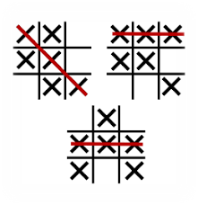
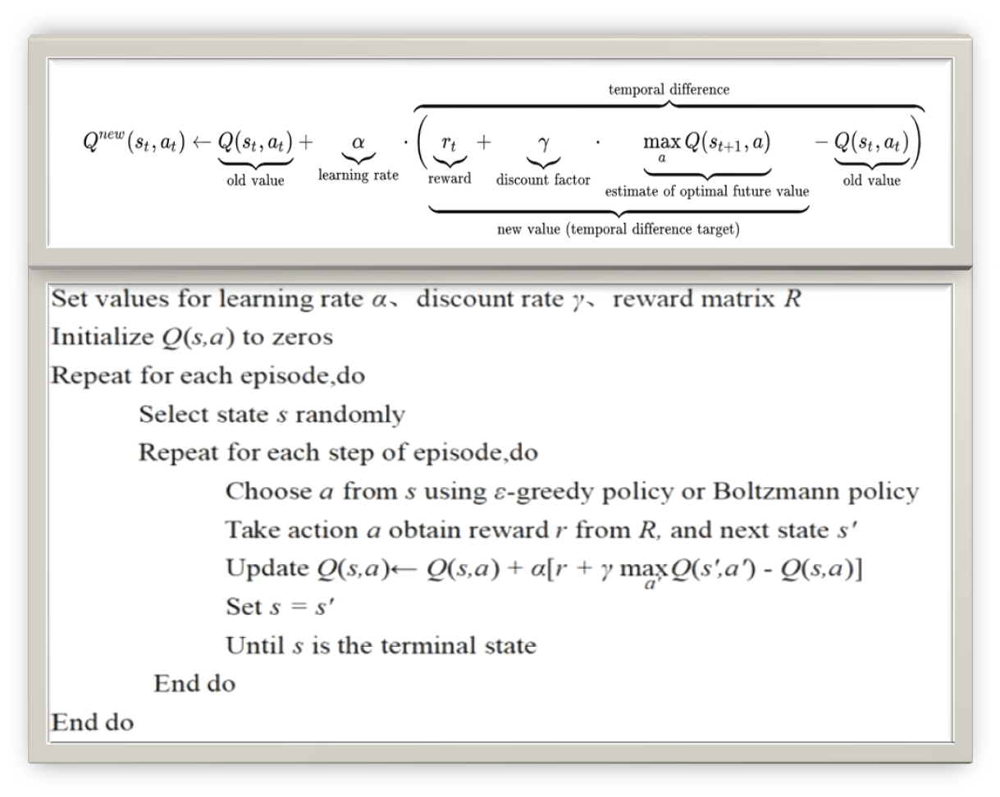

# Implementation-of-reinforcement-strategy-for-tic-tac-toe-player
----Ai-Final term project

----Team Members: Chunwang Yuan & Preetam Narendra Soni (Graduate students at University of New Haven. Pursuing MS, Data Science(Batch-Dec 2022))

## Introduction
Tic-Tac-Toe is a paper-and-pencil game for two players who take turns marking the spaces in a three-by-three grid with X or O. The player who succeeds in placing three of their marks in a horizontal, vertical, or diagonal row is the winner.

In this project, we have trained a agent who will learn how to play Tic-Tac-Toe with reinforcement learning. Then, the agent competed against with other player or with itself. Main implementation of this project was to train the agent to learn the strategy to find the best available move and beat other Agent. Comparing the algorithms we have learned in class,especially for any finite Markov decision process (FMDP), Q-learning is a model-free reinforcement learning algorithm to learn the value of an action in a particular state and can find an optimal policy in the sense of maximizing the expected value of the total reward over any and all successive steps, starting from the current state. Thus, we chosen Q-Learning algorithm to train the agent.  

### Overview
* Used two strategies: (RANDOM and Q-LEARNING) 
* Played 4 format of games: R vs R, R vs Q, Q vs R and Q vs Q
* Played 5,000 games using each strategy. And got the statistics using bar plot to compare the wins for Q-learning over Random and tested them for 5000 games after the game.

#### Tools and libraries used
* Python 3.6
* Spyder
* PyCharm
* Pandas
* Matplotlib

## Strategies
### RANDOM 
* Random strategy selects randomly from available moves and play. 
* This is a very general approach when initiating the game but may give tough time to opponent sometime.
* This approach helps us in making the game fair.

### Q-LEARNING
* Observation of the environment
* Deciding how to act using some strategy
* Acting accordingly
* Receiving a reward or penalty
* Learning from the experiences and refining our strategy
* Iterate until an optimal strategy is found

## Running code
Instructions on how to run the project:
* **Step 1:** Download the zip file or clone the repository.
* **Step 2:** cd to the directory where your downloaded folder is located.
* **Step 3:** open the project folder in spyder
* **Step 4:** open main.py and run

## Results
